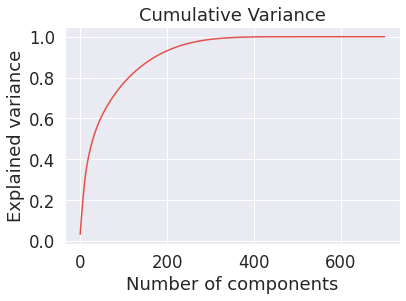
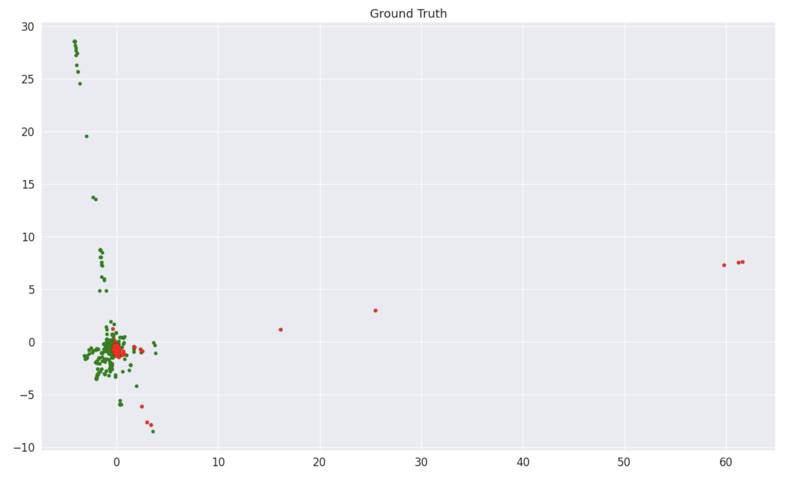
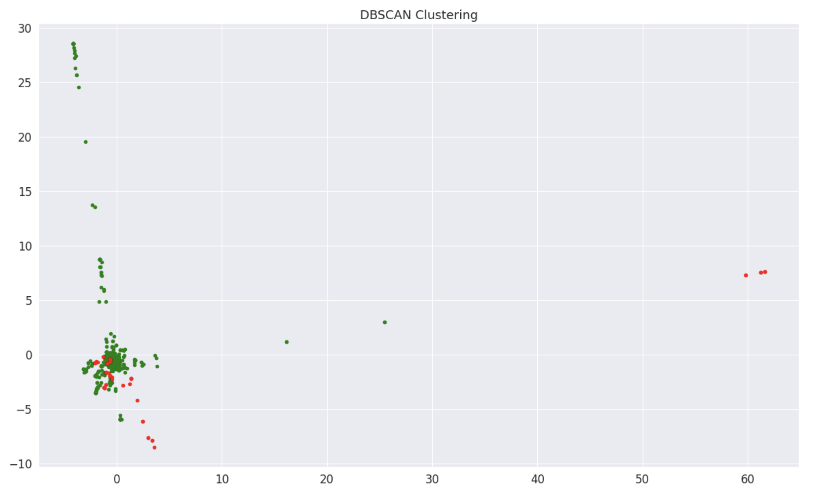

## Exposing Fake COVID-19 News

### Introduction
Social media plays an important role in disseminating Covid-19 related information. However, although social media is great at disseminating information, there aren't strong controls on what information gets spread. The goal of our project is to create a model to detect Covid-19 related “fake news”, i.e. information that is factually inaccurate or even dangerous. Our model will be able to tell whether a social media post is Covid-19 related and from there, decide whether the post is factual.

Data scientists have created fake news classifiers in the past, but nothing on the same scale has been done for Covid-19 specific information. Creating an unbiased classifier tailored to check social media posts about this topic will be extremely helpful in preventing the spread of misinformation online

### Methods (What we did / the plain results)

To obtain our initial dataset, we downloaded a set of Covid-19 related tweets which had already been labelled as real or fake. This was more difficult than expected as the only the tweet id's were given, so some web-scraping had to be done to obtain the tweet text itself. Furthermore, corrupted tweet ids or those missing vital information had to be purged from the dataset. By the end of the data-cleaning we were left with 1092 tweets to analyze, 12% of which were fake, with 88% as real.

We then performed vectorization to produce quantifiable data from the set of tweets. We decided on TF-IDF as our method of vectorization as it highlights the data which is most important in figuring out the validity of a tweet. This also solved the problem of data cleaning as TF-IDF recognizes the irrelevancy of words such as hyperlinks or those such as "the" or "of". With our vectorized dataset, we could now move onto dimensionality-reduction.

In order to examine our performance, we plotted various pieces of data and analyzed the results. To establish what dimensionality to use for our dataframe, we used PCA to obtain the explained variance ratio for each dimension and plotted the variance explained by dimensionality. We found that of the original 702 dimensions, only 314 were required to explain 99% of the variance in the data.

To visualize our clustering and labeling assignments, we plotted the first and second dimensions of our features as x and y coordinates, respectively. In our plots, we colored the points according to cluster assignment and real/fake label. After viewing these plots, we could see that we are able to differentiate the real and fake posts and group those into relatively distinct clusters. We initially generated the data for these plots using KMeans clustering, but eventually settled on DBScan as it proved more effective. Below, you can see the ground truth as well as the cluster assignments.

Additionally, we wanted to evaluate which features were corresponding most heavily to specific clusters. To achieve this, we plotted the normalized correlations for words in each cluster onto bar charts. These plots show that certain certain features are more strongly associated with certain clusters, and this can help us further evaluate how to differentiate tweets containing these features.

<images src="images/correlations_fake.png" />
<images src="images/correlations_true.png" />

----old------

Although some specifics are in flux, we already have a plan for the methods we'll use for this project. We're currently evaluating three datasets:

[CoAID](https://github.com/cuilimeng/CoAID/tree/master/07-01-2020)

To train the classifier, we need to convert the text of the post into a vector representation. We plan to explore multiple techniques, including TF-IDF, Doc2Vec, and BERT

This project also has an unsupervised learning component. We'd like to perform k-means clustering on the vectorized representations of articles from the Kaggle dataset. We want to see if we can find a cluster corresponding to healthcare-specific fake news.

For the supervised portion, we aim to develop a classifier that can label social media posts as true or false. For this task, we will train a classifier with post vectors and input and truth / falsehood labels as output. We will try multiple models, including SVM, Random Forest, and Logistic Regression. We will choose the model based on which performs the best, in terms of accuracy and F1 score.

Our approach has some unique aspects. Unlike some approaches, we will look at not only the text of the post, but also the text of the comments associated with that post. We believe this can increase accuracy in label prediction.

One risk of the project stems from false positives. If this system is used to automatically remove posts, and it removes a true post, then we risk enabling arbitrary censorship. Resultantly, we recommend that this system be strictly used with human supervision, i.e the output is used to flag posts, after which a human must manually review.

We believe this project is achievable within 2 months. We don't expect there to be any associated costs, since our methods aren't computationally expensive to implement.

### Results Summary (interpretation of the results)

{ETHAN}
By the end of this project, we want to create software in which users can upload a social media post to be scanned. From there, we will utilize machine learning principles to categorize the post as containing or not containing fake news about Coronavirus.

To guarantee we meet expectations, we have organized our checks for success as such:
- Mid-term check: use various clustering algorithms to determine if we are able to differentiate posts
- Final check: run application with existing datasets of posts and evaluate the performance

### Discussion

{HANNAH}
Ideally, our project will successfully categorize posts as ‘fake news’ or ‘not fake news’. If we are successful, our project could be used to flag fake news posts on social media for review. This would involve some room for error, as fake/real news can use similar phrases. Human review would allow for false positives without immediately taking down real new posts. Finally, our model would help control the spread of fake news and misinformation on social media sites, improving trust by the user. 

Our main outcome this phase was the production of vectors from our dataset, a process which included some data cleaning and feature selection using PCA. We found success with the K-Means algorithm, which will also be useful for the supervised learning portion of this project. We can use our implementation to determine which features were best able to predict classification, and to see cluster formation between fake and true subcategories. In this unsupervised learning portion, the heat maps we generated helped us understand what features are most significant in our dataset. In the next phase of our project, we will use heat maps to visualize the distribution of fake versus true news after running the supervised learning algorithms. Looking forward, we plan on training our classifiers using the output of our PCA implementation. Some algorithms that we are currently considering are SVM and random forest, and we also plan on trying out a few more to see what models work best with the nuances of our dataset.

### References
How Facebook Is Using AI to Fight COVID-19 Misinformation,
Tekla S. Perry,
[https://spectrum.ieee.org/view-from-the-valley/artificial-intelligence/machine-learning/how-facebook-is-using-ai-to-fight-covid19-misinformation](https://spectrum.ieee.org/view-from-the-valley/artificial-intelligence/machine-learning/how-facebook-is-using-ai-to-fight-covid19-misinformation)

Fake News Detection: A Deep Learning Approach,
Aswini Thota, Priyanka Tilak, Simrat Ahluwalia, Nibrat Lohia,
[https://scholar.smu.edu/cgi/viewcontent.cgi?article=1036&context=datasciencereview](https://scholar.smu.edu/cgi/viewcontent.cgi?article=1036&context=datasciencereview)

CoAID: COVID-19 Healthcare Misinformation Dataset,
Limeng Cui, Dongwon Lee,
[https://arxiv.org/pdf/2006.00885.pdf](https://arxiv.org/pdf/2006.00885.pdf)
