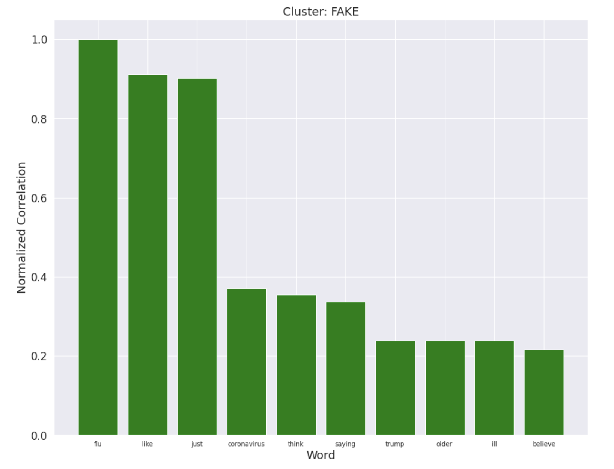
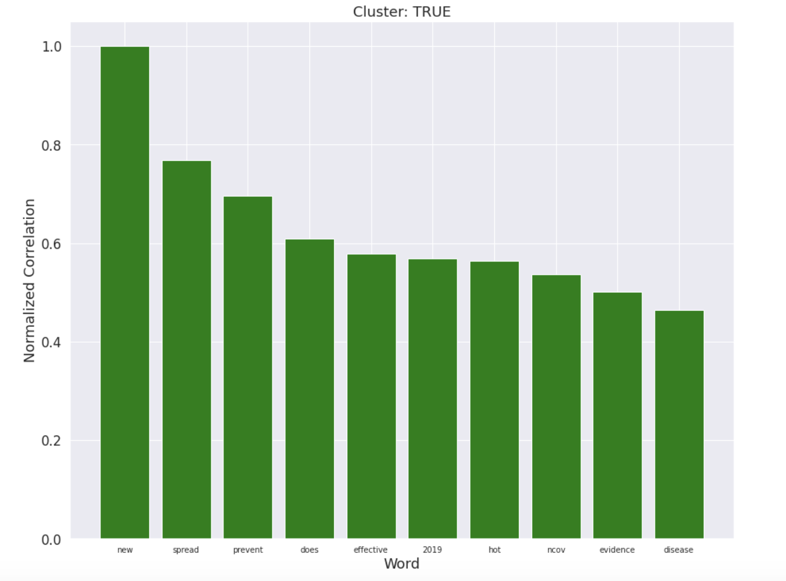

## Exposing Fake COVID-19 News

### Introduction
Social media plays an important role in disseminating Covid-19 related information. However, despite its importance, there aren't strong controls on what information gets spread. The goal of our project is to create a machine learning model to detect Covid-19 related “fake news”. This includes information that is factually inaccurate or even dangerous.

Data scientists have created fake news classifiers in the past, but we are not aware at any efforts to classify information related specifically to Covid-19. Creating a classifier tailored to check social media posts about this topic will be extremely helpful in preventing the spread of healthcare misinformation online.

### Methods
In the initial phase of the project, we focused on exploring the dataset using unsupervised techniques. This allows us to have a better understanding of our data, and to gain insights that may be useful when we proceed to the supervised learning step.

To obtain our initial dataset, we downloaded a set of Covid-19 related tweets which had already been labeled as true or false (decribed [here](https://github.com/cuilimeng/CoAID)). Using this dataset was more difficult than expected, since it only included tweet id's (reference numbers to an actual tweet). As a result, we had to create a web-scraper to search twitter for the tweet itself. Further, some tweets in the dataset had been deleted, requiring us to exclude those from the final dataset. After this initial data-cleaning stage, we were left with 1092 tweets to analyze. A simple analysis of the class imbalance showed that 12% were fake news, as compared to the 88% that were true.

We next performed a vectorization step to convert tweet text into numeric vectors. We used the Term Frequency-Inverse Document Frequency (TF-IDF) algorithm as our vectorization method. Every unique unigram or bigram within the input text corpus became a distinct feature within out dataset. The value of that feature for a given tweet is dependent on the frequency of the word(s) corresponding to that feature within the tweet. This step also involved additional data cleaning. Here, we dropped all columns that were composed of English "stop words" - which are simple words like "the" or "is", which tend not to carry significant semantic value.

At the end of the vectorization step, our data contained 702 dimensions. We used PCA to create a representation of this data with a lower dimensionality. Specifically, we chose the minimum number of PCA components that would capture 99% of the variance within the dataset. We found that the original 702 dimensional representation could be reduced to only the first 314 PCA dimensions, while still explaining 99% of the variance. A visualization of the cumulative variance explained by each PCA dimension is shown below.

In order to gain an intuitive understanding of the dataset, we attempted to visualize the pre-existing label assignments. We employed two techniques. The first made use of a two-dimensional plot, where the first and second PCA dimensions are shown on the X and Y axis, respectively. Each tweet within the dataset is graphed on this plot, and colored according to it's truth value. This plot is shown below, with true tweets in green, and false tweets in red.

[image]

We were encouraged by this visualization, since it appears that each label forms fairly distinctive groups. This portends well for future supervised learning / classification efforts. 

We also wanted to gain an understanding of the semantic differences between true and false tweets. To do this, we calculated the correlation between each class label, and all the single-word tf-idf features. We then sorted these tf-idf features based off of the correlation. In our visualization, we chose the top 10 mostly strongly correlated words for each class, and plotted their correlation strengths along the y-axis of a bar graph. We chose to normalize these correlations in order to better show the relative strengths of the relationships among all words shown. This plot is can be seen below.

[image]

After the earlier dimensionality reduction step, we also wanted to apply unsupervised clustering techniques to our data. We first attempted to employ K-Means clustering. In order to determine the proper number of clusters, we attempted to apply the elbow method of optimization. A plot comparing Within-Cluster-Sum-Of-Squares (WCSS) to the number of clusters is shown below.

[image]

As can be seen, the decrease is fairly linear with respect to increasing cluster number. This may indicate that K-Means is not the best approach for this dataset. Likely, this stems from the shape of the data, which appears to have one core circular region, and two oblong outer regions. Since K-Means is best suited to circularly clustered data, it likely cannot properly cluster the two oblong regions. Nonetheless, we were curious about further exploring the K-Means results. We performed K-Means with both 2 and 30 clusters. We explored these results through similar visualizations from the exploration of ground truth values.

The two-dimensional PCA plots for both 2-cluster and 30-cluster assignments can be seen below.

[image]

It's notable that these cluster assignments are visually quite different than the ground truth labels, likely indicating that the clusters produced by K-Means have created divisions of the original dataset that are semantically different than the ground-truth true/false division. We can visualize the semantic content of each cluster using the word correlation technique from earlier. The relevant bar charts are shown below.

[image]

To visualize our clustering and labeling assignments, we plotted the firswt and second dimensions of our features as x and y coordinates, respectively. In our plots, we colored the points according to cluster assignment and real/fake label. After viewing these plots, we could see that we are able to differentiate the real and fake posts and group those into relatively distinct clusters. We initially generated the data for these plots using KMeans clustering, but eventually settled on DBScan as it proved more effective. Below, you can see the ground truth as well as the cluster assignments.

Additionally, we wanted to evaluate which features were corresponding most heavily to specific clusters. To achieve this, we plotted the normalized correlations for words in each cluster onto bar charts. These plots show that certain certain features are more strongly associated with certain clusters, and this can help us further evaluate how to differentiate tweets containing these features.

----old------

Although some specifics are in flux, we already have a plan for the methods we'll use for this project. We're currently evaluating three datasets:

[CoAID](https://github.com/cuilimeng/CoAID/tree/master/07-01-2020)

To train the classifier, we need to convert the text of the post into a vector representation. We plan to explore multiple techniques, including TF-IDF, Doc2Vec, and BERT

This project also has an unsupervised learning component. We'd like to perform k-means clustering on the vectorized representations of articles from the Kaggle dataset. We want to see if we can find a cluster corresponding to healthcare-specific fake news.

For the supervised portion, we aim to develop a classifier that can label social media posts as true or false. For this task, we will train a classifier with post vectors and input and truth / falsehood labels as output. We will try multiple models, including SVM, Random Forest, and Logistic Regression. We will choose the model based on which performs the best, in terms of accuracy and F1 score.

Our approach has some unique aspects. Unlike some approaches, we will look at not only the text of the post, but also the text of the comments associated with that post. We believe this can increase accuracy in label prediction.

One risk of the project stems from false positives. If this system is used to automatically remove posts, and it removes a true post, then we risk enabling arbitrary censorship. Resultantly, we recommend that this system be strictly used with human supervision, i.e the output is used to flag posts, after which a human must manually review.

We believe this project is achievable within 2 months. We don't expect there to be any associated costs, since our methods aren't computationally expensive to implement.

### Results Summary (interpretation of the results)

{ETHAN}
By the end of this project, we want to create software in which users can upload a social media post to be scanned. From there, we will utilize machine learning principles to categorize the post as containing or not containing fake news about Coronavirus.

To guarantee we meet expectations, we have organized our checks for success as such:
- Mid-term check: use various clustering algorithms to determine if we are able to differentiate posts
- Final check: run application with existing datasets of posts and evaluate the performance

### Discussion

{HANNAH}
Ideally, our project will successfully categorize posts as ‘fake news’ or ‘not fake news’. If we are successful, our project could be used to flag fake news posts on social media for review. This would involve some room for error, as fake/real news can use similar phrases. Human review would allow for false positives without immediately taking down real new posts. Finally, our model would help control the spread of fake news and misinformation on social media sites, improving trust by the user. 

Our main outcome this phase was the production of vectors from our dataset, a process which included some data cleaning and feature selection using PCA. We found success with the K-Means algorithm, which will also be useful for the supervised learning portion of this project. We can use our implementation to determine which features were best able to predict classification, and to see cluster formation between fake and true subcategories. In this unsupervised learning portion, the heat maps we generated helped us understand what features are most significant in our dataset. In the next phase of our project, we will use heat maps to visualize the distribution of fake versus true news after running the supervised learning algorithms. Looking forward, we plan on training our classifiers using the output of our PCA implementation. Some algorithms that we are currently considering are SVM and random forest, and we also plan on trying out a few more to see what models work best with the nuances of our dataset.

### References
How Facebook Is Using AI to Fight COVID-19 Misinformation,
Tekla S. Perry,
[https://spectrum.ieee.org/view-from-the-valley/artificial-intelligence/machine-learning/how-facebook-is-using-ai-to-fight-covid19-misinformation](https://spectrum.ieee.org/view-from-the-valley/artificial-intelligence/machine-learning/how-facebook-is-using-ai-to-fight-covid19-misinformation)

Fake News Detection: A Deep Learning Approach,
Aswini Thota, Priyanka Tilak, Simrat Ahluwalia, Nibrat Lohia,
[https://scholar.smu.edu/cgi/viewcontent.cgi?article=1036&context=datasciencereview](https://scholar.smu.edu/cgi/viewcontent.cgi?article=1036&context=datasciencereview)

CoAID: COVID-19 Healthcare Misinformation Dataset,
Limeng Cui, Dongwon Lee,
[https://arxiv.org/pdf/2006.00885.pdf](https://arxiv.org/pdf/2006.00885.pdf)
