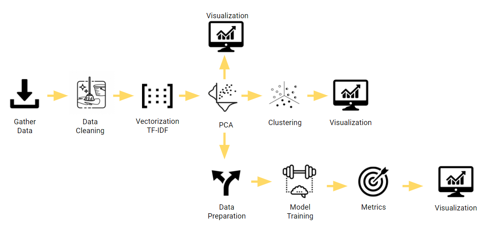
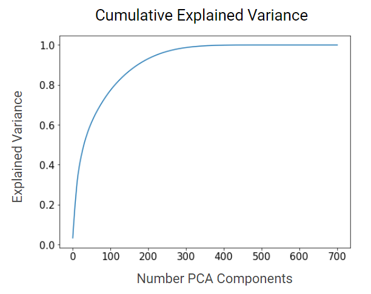
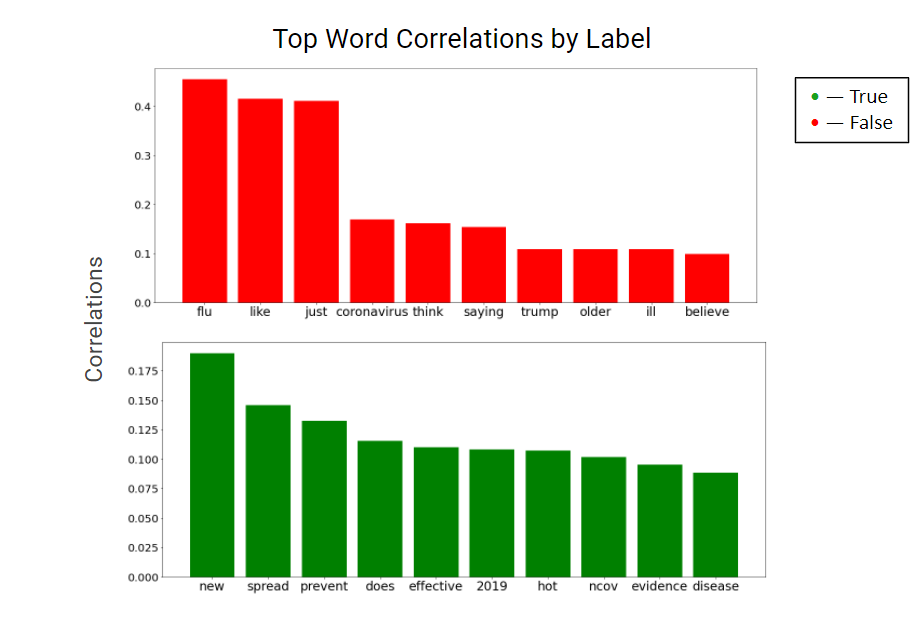
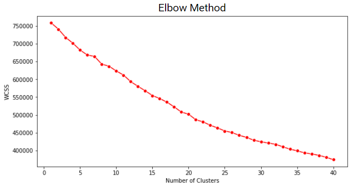
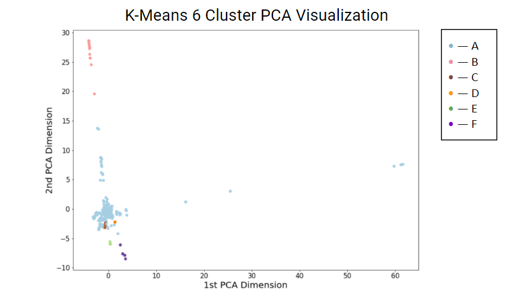
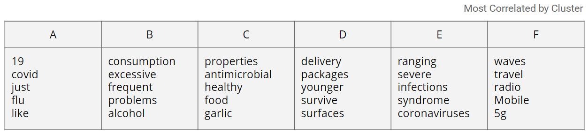
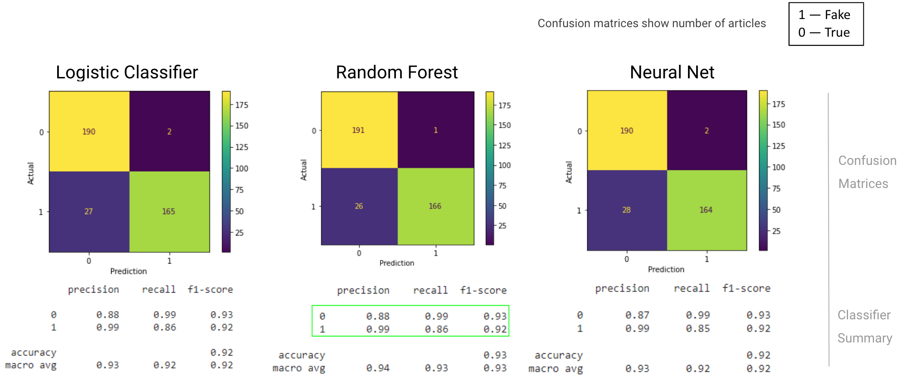
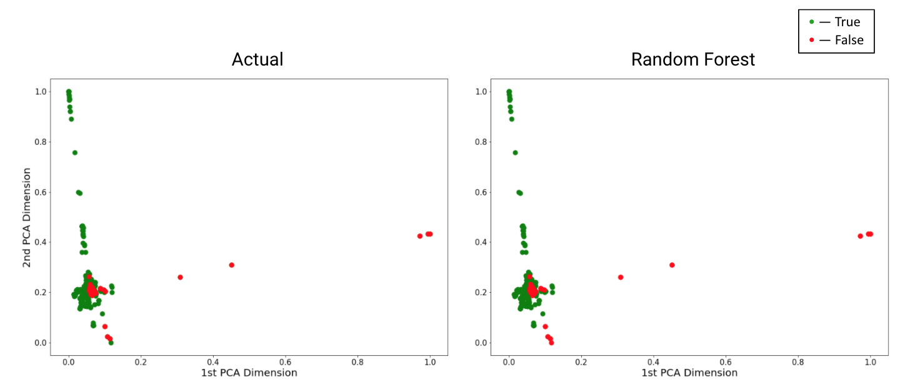
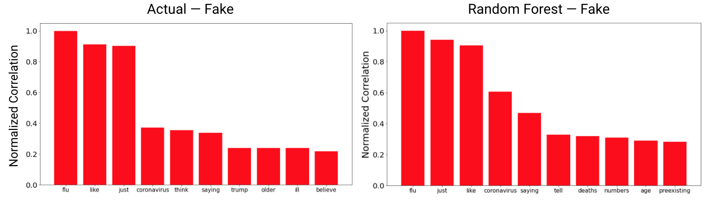

## Exposing Fake COVID-19 News — Group 34

### Produced By:
Ben Chuang · Hannah Donahue · Will Hunter · Ethan Roland

### Summary Figure

## Introduction
Social media plays an important role in disseminating Covid-19 related information. However, despite its importance, there aren't strong controls on what information gets spread. The goal of our project is to create a machine learning model to detect Covid-19 related “fake news”. This includes information that is factually inaccurate or even dangerous.

Data scientists have created fake news classifiers in the past, but we are not aware at any efforts to classify information related specifically to Covid-19. Creating a classifier tailored to check social media posts about this topic will be extremely helpful in preventing the spread of healthcare misinformation online.

## Unsupervised Methods
In the initial phase of the project, we focused on exploring the dataset using unsupervised techniques. This allows us to have a better understanding of our data, and to gain insights that may be useful when we proceed to the supervised learning step.

To obtain our initial dataset, we downloaded a set of Covid-19 related tweets which had already been labeled as true or false (decribed [here](https://github.com/cuilimeng/CoAID)). Using this dataset was more difficult than expected, since it only included tweet id's (reference numbers to an actual tweet). As a result, we had to create a web-scraper to search Twitter for the tweet itself. Further, some tweets in the dataset had been deleted, requiring us to exclude those from the final dataset. After this initial data-cleaning stage, we were left with 1092 tweets to analyze. A simple analysis of the class imbalance showed that 12% were fake news, as compared to the 88% that were true. We resolved this imbalance by oversampling the fake datapoints to create an artificially balanced dataset.

We next performed a vectorization step to convert tweet text into numeric vectors. We used the Term Frequency-Inverse Document Frequency (TF-IDF) algorithm as our vectorization method. Every unique unigram or bigram within the input text corpus became a distinct feature within our dataset. The value of that feature for a given tweet is dependent on the frequency of the word(s) corresponding to that feature within the tweet. This step also involved additional data cleaning. Here, we dropped all columns that were composed of English "stop words" - which are simple words like "the" or "is" that tend not to carry significant semantic information.

At the end of the vectorization step, our data contained 702 dimensions. We used PCA to create a representation of this data with a lower dimensionality. Specifically, we chose the minimum number of PCA components that would capture 99% of the variance within the dataset. We found that the original 702 dimensional representation could be reduced to only the first 314 PCA dimensions, while still explaining 99% of the variance. A visualization of the cumulative variance explained by each PCA dimension is shown below.

In order to gain an intuitive understanding of the dataset, we attempted to visualize the pre-existing label assignments. We employed two techniques. The first made use of a two-dimensional plot, where the first and second PCA dimensions are shown on the X and Y axis, respectively. Each tweet within the dataset is graphed on this plot, and colored according to it's truth value. This plot is shown below, with true tweets in green, and false tweets in red.

We were encouraged by this visualization, since it appears that each label forms fairly distinctive groups. This portends well for future supervised learning / classification efforts. 

We also wanted to gain an understanding of the semantic differences between true and false tweets. To do this, we calculated the correlation between each class label, and all the single-word tf-idf features. We then sorted these tf-idf features based off of the correlation. In our visualization, we chose the top 10 mostly strongly correlated words for each class, and plotted their correlation strengths along the y-axis of a bar graph. This plot can be seen below.

This visualization allows us to get an inuitive understanding of the topics associated with each label. For instance, it appears that true tweets tend to focus on topics related to disease prevention and "evidence", while false tweets tend to contain comparisons to the common flu, and may contain referenes to political leaders.

After the earlier dimensionality reduction step, we also wanted to apply unsupervised clustering techniques to our data. We first attempted to employ K-Means clustering. In order to determine the proper number of clusters, we attempted to apply the elbow method of optimization. A plot comparing Within-Cluster-Sum-Of-Squares (WCSS) to the number of clusters is shown below.

As can be seen, the decrease is fairly linear with respect to increasing cluster number. This may indicate that K-Means is not the best approach for this dataset. Likely, this stems from the shape of the data, which appears to have one core circular region, and two oblong outer regions. Since K-Means is best suited to circularly clustered data, it likely cannot properly cluster the two oblong regions. Nonetheless, we were curious about further exploring the K-Means results. We performed K-Means, arbitrarily configured to find 6 clusters. We explored the results through the same PCA and word-correlation techniques as earlier.

The two-dimensional PCA plot for the 6-cluster assignments can be seen below.

It's notable that these cluster assignments are visually quite different from the ground truth labels, likely indicating that the clusters produced by K-Means have created divisions of the original dataset that are semantically different than the ground-truth true/false division. We can explore the semantic content of each cluster using the word correlation technique from earlier. For ease of understanding, we omit the bar charts and instead show the most correlated words in a tabular format.

The 6-cluster K-Means results are interesting because each cluster seems to represent a semantically distinct topic. For instance, it appears that the cluster __F__ is distinctly related to 5G mobile technology. This likely stems from tweets that promote conspiracies linking 5G with covid-19.

In addition to K-Means clustering, we also we felt that DBSCAN clustering may produce interesting results. DBSCAN has two main hyperparameters: epsilon and min_samples. Epsilon controls how "far out" DBSCAN can look from an existing cluster assignment in order to claim an additional point. Min_samples controls the minimum number of samples required for a cluster to be created. We tuned these hyperparameters using grid search. Specifically, we sought to maximize classification f1-score relative to the ground truth. We performed this grid search on the artificially balanced dataset and got a maximum f1-score of 0.53. While DBSCAN was able to classify datapoints accurately more often than chance, the low number indicates that it's ability to do so is limited.

We visualize our clustering results using the same PCA method as before. The 2D PCA plot of the DBSCAN cluster assignments is shown below.

Note that this plot shows significant visual similarity to the plot of the ground truth labels, especially with respect to the cluster assignments within the oblong regions.

We also want to explore the semantic associations of each cluster. This is shown in the word correlation graphs below.

We again see a close connection between DBSCAN cluster assignments and ground truth values. In particular, the word correlations for cluster __B__ closely resemble the word correlations for false tweets.

### Unsupervised Results Summary

In the unsupervised portion of this project, we were able to complete all of our original goals and gain deep insights about the nature of our dataset. The three main tasks completed include:
- successful production of numeric vectors from text using TF-IDF
- dimensionality reduction using PCA
- data clustering and visualization using DBSCAN and K-Means

Crucially, we met our goal for the unsupervised learning phase by successfully producing clustered data and comparing those clusters to ground truth values.

Looking forward, we can see that, while the supervised learning effort will likely produce useful results, the visual ambiguity in parts of the 2D PCA plot of ground truth labels may indicates that the system will have difficulty differentiating between true and false in some cases. This may help shape usage policy for our final classifier. We advocate it's use solely to flag potentially misleading tweets, which are then sent to a human for manual review. This approach can help avoid unnecesarry censorship.

As a check-for-success in the supervised learning portion of this assignment, we intend on producing a classifier that accurately differentiates between fake and true news, and producing metrics for its performance.

## Supervised Methods

Our results from the unsupervised portion were critical in informing our choices during the supervised portion of this project.

During the unsupervised phase of the project, we discovered that our dataset is comprised of 88% real and 12% fake tweets. However, running a classifier on such an imbalanced dataset would cause the models to classify a disproportionate number of tweets as real. To resolve this issue, we oversampled the fake data and created a new dataset containing 50% real tweets and 50% fake. We then utilized stratified sampling to make sure both training and testing datasets contained an equal distribution of real and fake tweets.

To determine which classifiers worked best for our dataset, we trained multiple classifiers which we believed would perform well and compared their performances. We experimented with Logistic Regression, Linear SVM, Kernel SVM, Random Forest, Neural Net, & Naïve Bayes. We trained the models using the PCA output we produced during the unsupervised learning phase. To achieve optimal performance, an individualized grid search was performed on each classifier to tune its hyperparameters in order to optimize the cross validated f1-score. For hyperparameters of varying magnitude, a form of exponential search was utilized to find a balance between search range and time complexity. The tuned classifiers all resulted in higher f1-scores than their default counterparts. 

### Supervised Results Summary

The three best performing models were Logistic Regression, Neural Net, and Random Forest. Below, you can see the cross validated performance summary and confusion matrix of each model. Most of the performance scores were very similar, but the fake-tweet recall of the Random Forest was slightly higher than the other models. The cross validated f1-score of the Random Forest model was 0.93. We therefore concluded that the Random Forest model was the best predictor for our data.

In general, we were quite satisfied with the performance of all classifiers. Even a classifier that depends on linear separability, like Linear SVM, still performed quite well. This may be a reflection of the stark geometric distinction between the true and false labels, as visible in the ground truth PCA plot. The fact that the input features were the output of running Principle Component Analysis may have confered a unique advantage to the Random Forest Classifier, explaining its high performance. Decision tree based methods can only find decision boundaries along a single feature. Because PCA outputs features that are all orthogonal to each other, this orthogonality may increase the quality of the decision boundaries identified by Random Forest.

To visualize the Random Forest's performance, we can view a 2D representation of the classification results.

We graphed each data point using the normalized first and second PCA components of that point, and colorized the point based on the assigned class. The left graph shows *actual* true/false labels, and the right graph shows *predicted* labels. The graphs show an obvious visual similarity, reflecting the high performance of the Random Forest.

Below, we graph the correlation between fake tweets and the words within those tweets. This visualization gives us a feeling for the topics discussed within these misleading tweets. The left graph shows correlations for actual fake tweets, and the right graph shows correlations for tweets we predict to be fake. We can see that the topics discussed in *actual* fake tweets are very similar to the topics discussed in tweets we *predicted* to be fake.

## Discussion

Through the use of unsupervised and supervised machine learning algorithms, our project can reliably identify fake news with a cross validated f1-score of 0.93. With this success, the results of our project could be used to flag fake news posts on social media for further review. This involves some room for error, as our implementation isn’t 100% accurate at labeling fake/real posts. To fully utilize these predictions, we recommend adding in an element of human review to allow for false positives without immediately taking down real posts. Through this system of flagging and reviewing, our model can be used to help control the spread of fake news and misinformation surrounding Covid-19 on social media sites and improve trust by the user.

We hope the results of this project inspire more research on the detection of Covid-specific fake news. Social media platforms can implement similar techniques to flag posts for review, with the ultimate goal of reducing the spread of misinformation surrounding the coronavirus pandemic.

### References
How Facebook Is Using AI to Fight COVID-19 Misinformation,
Tekla S. Perry,
[https://spectrum.ieee.org/view-from-the-valley/artificial-intelligence/machine-learning/how-facebook-is-using-ai-to-fight-covid19-misinformation](https://spectrum.ieee.org/view-from-the-valley/artificial-intelligence/machine-learning/how-facebook-is-using-ai-to-fight-covid19-misinformation)

Fake News Detection: A Deep Learning Approach,
Aswini Thota, Priyanka Tilak, Simrat Ahluwalia, Nibrat Lohia,
[https://scholar.smu.edu/cgi/viewcontent.cgi?article=1036&context=datasciencereview](https://scholar.smu.edu/cgi/viewcontent.cgi?article=1036&context=datasciencereview)

CoAID: COVID-19 Healthcare Misinformation Dataset,
Limeng Cui, Dongwon Lee,
[https://arxiv.org/pdf/2006.00885.pdf](https://arxiv.org/pdf/2006.00885.pdf)

### Links
Unsupervised Colab: [https://colab.research.google.com/drive/1ZzHke7KS7PVrD3Q1yTxCcyKJLDQDFHdr?usp=sharing](https://colab.research.google.com/drive/1ZzHke7KS7PVrD3Q1yTxCcyKJLDQDFHdr?usp=sharing)

Supervised Colab: [https://colab.research.google.com/drive/1KjQYkK-9KcYAwyQ_9UF8l5KytRyavnmd#scrollTo=d3-M9VoFVVgs](https://colab.research.google.com/drive/1KjQYkK-9KcYAwyQ_9UF8l5KytRyavnmd#scrollTo=d3-M9VoFVVgs)

Final Report Video: [https://www.youtube.com/watch?v=xXQwCKvHHhI](https://www.youtube.com/watch?v=xXQwCKvHHhI)
